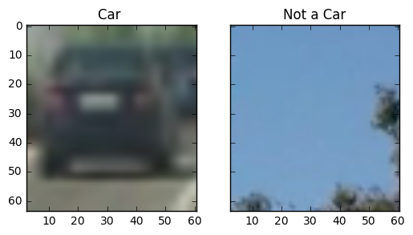
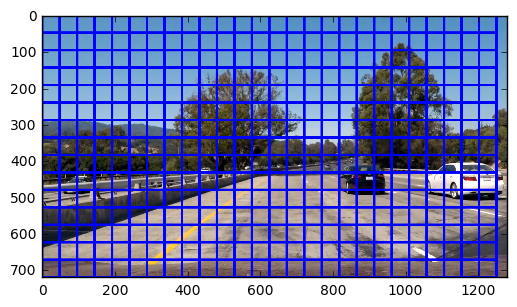
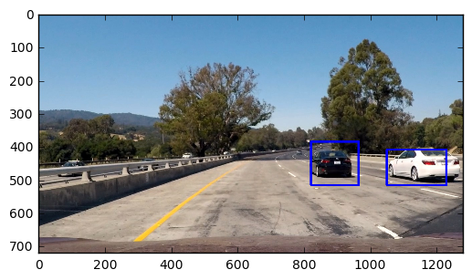
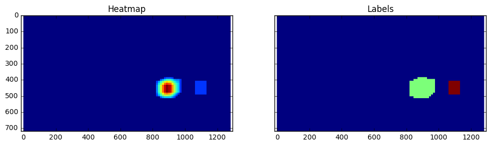

##Writeup Template
###You can use this file as a template for your writeup if you want to submit it as a markdown file, but feel free to use some other method and submit a pdf if you prefer.

---

**Vehicle Detection Project**

The goals / steps of this project are the following:

* Perform a Histogram of Oriented Gradients (HOG) feature extraction on a labeled training set of images and train a classifier Linear SVM classifier
* Optionally, you can also apply a color transform and append binned color features, as well as histograms of color, to your HOG feature vector. 
* Note: for those first two steps don't forget to normalize your features and randomize a selection for training and testing.
* Implement a sliding-window technique and use your trained classifier to search for vehicles in images.
* Run your pipeline on a video stream (start with the test_video.mp4 and later implement on full project_video.mp4) and create a heat map of recurring detections frame by frame to reject outliers and follow detected vehicles.
* Estimate a bounding box for vehicles detected.


###Histogram of Oriented Gradients (HOG)

####1. Explain how (and identify where in your code) you extracted HOG features from the training images.

The code for this step is contained in the 2nd and 3rd code cell of the IPython notebook `vehicle-detection.ipynb`.  

I started by reading in all the `vehicle` and `non-vehicle` images.  Here is an example of one of each of the `vehicle` and `non-vehicle` classes:



I then explored different color spaces and different `skimage.hog()` parameters (`orientations`, `pixels_per_cell`, and `cells_per_block`).  I grabbed random images from each of the two classes and displayed them to get a feel for what the `skimage.hog()` output looks like.

Here is an example using the `RGB` color space and HOG parameters of `orientations=9`, `pixels_per_cell=(8, 8)` and `cells_per_block=(2, 2)`:


![alt text][output_images/img2.png]

####2. Explain how you settled on your final choice of HOG parameters.

I tried various combinations of parameters for color space , orientation etc, and finally settled with following params

```
color_space = 'RGB' # Can be RGB, HSV, LUV, HLS, YUV, YCrCb
orient = 9  # HOG orientations
pix_per_cell = 8 # HOG pixels per cell
cell_per_block = 2 # HOG cells per block
spatial_size = (16, 16) # Spatial binning dimensions
hist_bins = 16    # Number of histogram bins
spatial_feat = True # Spatial features on or off
hist_feat = True # Histogram features on or off
hog_feat = True # HOG features on or off
y_start_stop = [400, 656] # Min and max in y to search in slide_window()
orientations = 9  # HOG orientations
pixels_per_cell = 8 # HOG pixels per cell
hog_channel = 'ALL' # Can be 0, 1, 2, or "ALL"
spatial_size = (16, 16) # Spatial binning dimensions
```


####3. Describe how (and identify where in your code) you trained a classifier using your selected HOG features (and color features if you used them).

I trained a linear SVM using the extracted hog features and color features, could be found in the source code in 6th code cell.

```
svc = LinearSVC()

t=time.time()
svc.fit(X_train, y_train)
t2 = time.time()
print(round(t2-t, 2), 'Seconds to train SVC...')
```

it took around 10.26 second on training the whole train set.


###Sliding Window Search

####1. Describe how (and identify where in your code) you implemented a sliding window search.  How did you decide what scales to search and how much to overlap windows?

As the car starts from right, the size get bigger and when it goes too far, the size get smaller.
I examined various window sizes, regions and overlap. Found that the area for y -asiz between 385 and 550, is the most of time the car can be spotted.

so kept the same size for he search window.

the implementation could be seen in code cell 16 of `vehicle-detection.ipynb` notebook file.

here is the example of all region area , before putting a location




####2. Show some examples of test images to demonstrate how your pipeline is working.  What did you do to optimize the performance of your classifier?

First i started with HSV color space and the accuracy of classifier was around 90%, then with mutiple combinations of parameters and sample sizes, reached the accuracy of 98%.
Here are some example images:


---

### Video Implementation

####1. Provide a link to your final video output.  Your pipeline should perform reasonably well on the entire project video (somewhat wobbly or unstable bounding boxes are ok as long as you are identifying the vehicles most of the time with minimal false positives.)

Here's a [link to my video result](./project_video_output.mp4)
youtube : [](https://youtu.be/2HUcx5F7u7M)


####2. Describe how (and identify where in your code) you implemented some kind of filter for false positives and some method for combining overlapping bounding boxes.

I tried to minimize the false positive by applying threshold and limiting the heatmap, it can be seen in code cell 16 of the `vehicle-detection.ipynb` in the update_heatmap method. tried to find the maximum of all heat maps, to reduce mutiple boxes.

here are the examples of heatmap and their labels.




---

###Discussion

####1. Briefly discuss any problems / issues you faced in your implementation of this project.  Where will your pipeline likely fail?  What could you do to make it more robust?

The classifer is not yet stable, as it still finds out few things which are not cars. Also, need to improve on the filtering area, as in the video, some of the areas which is bigger than the cars also has been marked. the pipeline will fail with overlapping multiple cars side by side, and in more colourful background which can be a distraction to the classifier.
In near few weeks, Will try to optimize for reduction of false positive cases and try to utilize deep learning with SVM for better classification.
